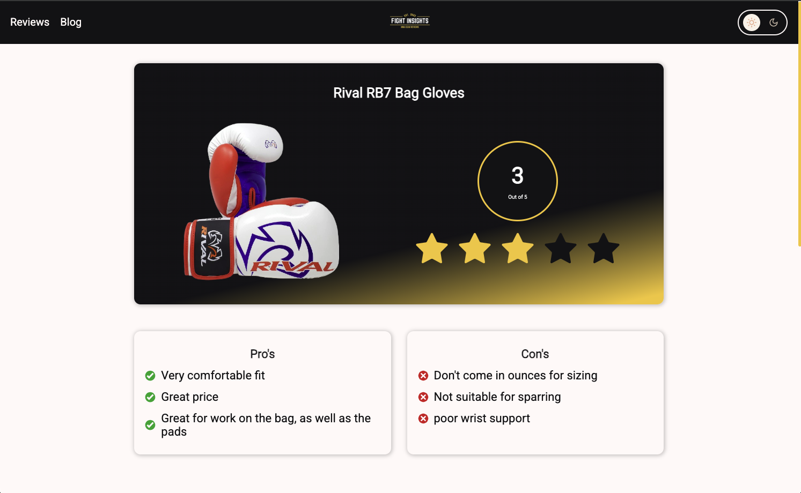
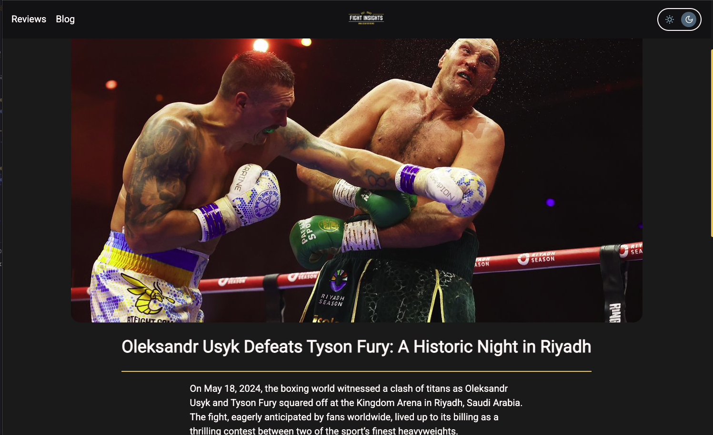

# Fight Insights

A **Next.js web application** powered by a **headless WordPress CMS**, designed to deliver MMA fight news, blogs, and gear reviews with modern frontend performance and SEO optimizations.

🔗 **Live Site:** [fightinsights.ca](https://www.fightinsights.ca)

---

## 📸 Screenshots

---

## 🚀 Features

- **Next.js (Pages Router)** for server-side rendering (SSR), static site generation (SSG), and optimized routing
- **GraphQL (Apollo Client)** integration with WordPress for fetching posts, reviews, and categories
- **Headless CMS with WordPress** to manage blog content, media, and structured review data
- **CSS Modules** for component-scoped styles without global conflicts
- **Theme Switcher** with CSS variables for light/dark mode
- **Responsive Design** optimized for desktop and mobile
- **Dynamic Routing** for posts and reviews (`/posts/[slug]`, `/reviews/[slug]`)
- **SEO-Friendly Metadata** with `next/head` and Open Graph tags
- **Deployment on Vercel** for fast, production-ready hosting

---

## 🛠️ Tech Stack

- [Next.js](https://nextjs.org/)
- [React](https://reactjs.org/)
- [Apollo Client](https://www.apollographql.com/docs/react/)
- [WordPress CMS (Headless)](https://wordpress.org/)
- [GraphQL](https://graphql.org/)
- [CSS Modules](https://nextjs.org/docs/basic-features/built-in-css-support#adding-component-level-css)
- [Vercel](https://vercel.com/)
